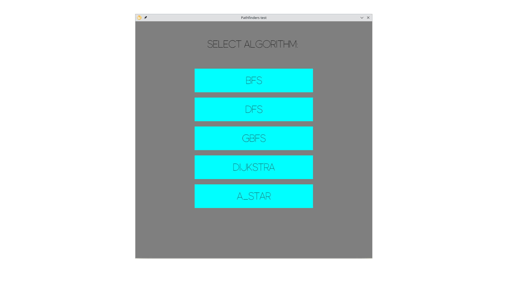
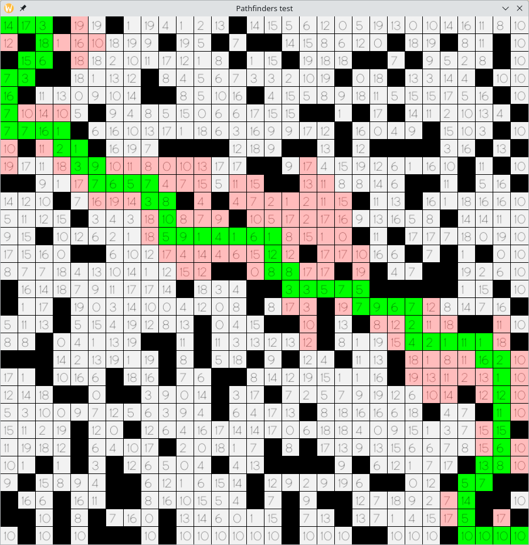

# Pathfinders

---

The project is a simple visualization of algorithms such as:

- Breadth first search
- Depth first search
- Greedy best first search
- Dijkstra
- A_Star

<div style="display: flex; flex-direction: row; flex-wrap: nowrap;">


</div>


[//]: # (![Image1]&#40;./assets/menu.png&#41; ![Image2]&#40;./assets/astar.png&#41; )

---

[](https://github.com/killpop3770/pathfinder_a_star)

## Build and Run

First, make sure the following are installed:

1. [Rust](https://www.rust-lang.org/tools/install)

In order to build, first clone the github repo:

```sh
git clone https://github.com/killpop3770/pathfinder_a_star
cd pathfinder_a_star
```

Then run:

```sh
cargo build && cargo run
```

## Hints

The control is carried out with the mouse or:

- Keys 1-5 to call algorithm
- "Esc" key to return to the main menu

## TODO
- [x] minimal viable product
- [ ] make gradient for cell cost
- [ ] make one/two default map/maze for all algorithms
- [ ] handle error from threads


## Acknowledgements

- [piston_window](https://github.com/PistonDevelopers/piston_window)
