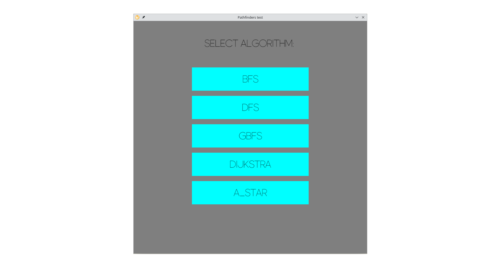

# Pathfinders Visualizer

A high-performance, real-time visualization of classic pathfinding and graph traversal algorithms, built with Rust. 

This project demonstrates a clean, layered architecture, separating domain logic, algorithms, configuration, and presentation layers, ensuring maintainability and testability.

<div style="display: flex; flex-direction: row; flex-wrap: nowrap;">
  
  
</div>

---

[](https://www.rust-lang.org)
[](LICENSE)
[](https://github.com/killpop3770/pathfinders)


## ✨ Features

- **Multiple Algorithms**: BFS, DFS, Greedy Best-First Search, Dijkstra, and A*.
- **Layered Architecture**: Strict separation of `domain`, `algorithms`, `config`, and `presentation` layers.
- **High Performance**: Optimized 1D flat-vector grid representation and minimal mutex locking for smooth 60 FPS rendering.
- **Configurable**: Easy customization of grid size, cell size, and animation speed via `config.toml`.


##  Performance

After major refactoring (v0.2.0 → v1.0.0), the application shows significant improvements:

- **Memory usage**: -11.9% (from 11.47 MB to 10.11 MB)
- **Execution time**: -73% (3.7× faster)
- **Heap efficiency**: -12.0% less fragmentation

See [benchmarks/](./benchmarks/) for detailed measurements and methodology.

### Memory Usage Comparison

- v0.2.0: ████████████████████ 11.47 MB
- v1.0.0: ████████████████     10.11 MB (-11.9%)


### Execution Time

- v0.2.0: ████████████████████ ~11.0s
- v1.0.0: █████                ~3.0s (-73%)


## 🏗️ Project Structure

```sh
src/
├── domain/         # Core data structures (Cell, Field) with zero external dependencies
├── algorithms/     # Pathfinding logic (BFS, A*, etc.) implementing the Algorithm trait
├── config/         # Configuration parsing (TOML) and application constants
├── presentation/   # UI rendering (Piston) and event handling
└── state/          # Thread-safe state management (SharedState)
```

## 🚀 Build and Run


### Prerequisites
Make sure you have [Rust](https://www.rust-lang.org/tools/install) installed on your system.


### Installation
Clone the repository and navigate to the project directory:
```sh
git clone https://github.com/killpop3770/pathfinders.git
cd pathfinders
```

Then run:

```sh
cargo build && cargo run
```


## 🎮 Controls (Hints)
- Keys 1 - 5: Quickly start a specific algorithm from the main menu.
- Esc: Stop the current algorithm and return to the main menu.


## 🛣️ Roadmap (TODO)

- [x] Minimal Viable Product (MVP) with basic algorithms and UI
- [x] Refactor to a strict layered architecture (Domain, Algorithms, Config, Presentation)
- [ ] **Core algos/graphic**: Replace core algos and graphic logic in outer crates (libs)
- [ ] **Update README.md**: Update pic and gif about app
- [ ] **Advanced Maze Generation**: Replace random noise with proper algorithms (Recursive Backtracker, Prim's, Perlin Noise)
- [ ] **Custom Maps**: Add support for loading and saving maps from/to files (e.g., JSON or custom format)
- [ ] **Runtime Controls**: Add ability to change animation speed on the fly (e.g., via `+`/`-` keys or mouse wheel)
- [ ] **On-screen Statistics**: Display real-time overlay with visited cells count, path length, elapsed time, and current speed
- [ ] **Comprehensive Testing**: Add unit and integration tests for the `domain` and `algorithms` layers
- [ ] **Architectural Linting**: Integrate `dylint` or custom `archtest` to enforce layer boundaries and prevent dependency cycles
- [ ] **Robust Error Handling**: Improve graceful recovery and error reporting from background algorithm threads


## Acknowledgements

- [piston_window](https://github.com/PistonDevelopers/piston_window) for the 2D rendering engine.
- The Rust community for excellent documentation and crates (serde, toml, log).
